

  

 

  

 

## 👋 About me

My name is **Derek**. I consider IT as the main direction of my professional career. This field is close to me, and I am confident that I can realize my potential here. I am focused on continuous development, solving real-world problems, working on actual projects, and improving my qualifications as a specialist. I am ready to learn new tools, figure out complex technical issues.

> *It does not matter how slowly you go as long as you do not stop. (Confucius)*

---

## 🔥 Three areas that interest me

| № | Area | What interests me |
|:-:|------|--------------------|
| 1️⃣ | **Software Development** | I have experience in C, C++, C#, Python, LabView (graphical programming), working with SQLite and PostgreSQL. I like to program and often use programming to automate tasks. |
| 2️⃣ | **Cybersecurity** | This is the most interesting field for me because it requires different skills: cryptography, OS administration, network building. Cryptography was one of my favorite subjects at university. |
| 3️⃣ | **Data Science** | This specialty includes programming + math. Python is my favorite language. I have experience with Pandas and NumPy. I am keen on math — I always had the best marks. Math is the queen of sciences. |

---

## 🛠️ Tech stack

<table border="0" cellpadding="8" cellspacing="0" style="border-collapse: collapse; width: 100%;">
  <!-- Languages -->
  <thead>
    <tr>
      <th>Category</th>
      <th>Icon</th>
      <th>Technology</th>
    </tr>
  </thead>
  <tr>
    <td rowspan="5"><strong>Languages</strong></td>
    <td></td>
    <td>C</td>
  </tr>
  <tr>
    <td></td>
    <td>C++</td>
  </tr>
  <tr>
    <td></td>
    <td>C#</td>
  </tr>
  <tr>
    <td></td>
    <td>Python</td>
  </tr>
  <tr>
    <td></td>
    <td>LabView</td>
  </tr>

  <!-- Frameworks -->
  <tr>
    <td rowspan="2"><strong>Frameworks & GUI</strong></td>
    <td></td>
    <td>Qt</td>
  </tr>
  <tr>
    <td>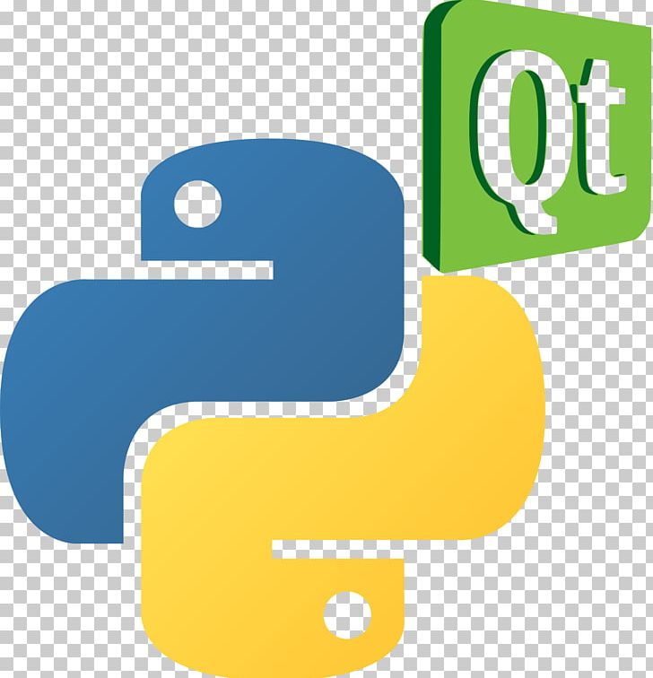</td>
    <td>PyQt5</td>
  </tr>

  <!-- Databases -->
  <tr>
    <td rowspan="4"><strong>Databases</strong></td>
    <td></td>
    <td>PostgreSQL</td>
  </tr>
  <tr>
    <td></td>
    <td>SQLite</td>
  </tr>
  <tr>
    <td>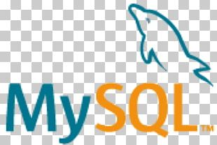</td>
    <td>MySQL</td>
  </tr>
  <tr>
    <td>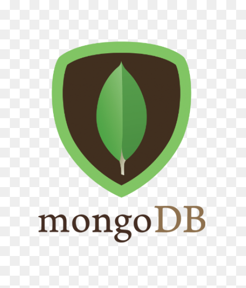</td>
    <td>MongoDB</td>
  </tr>

  <!-- DevOps -->
  <tr>
    <td rowspan="6"><strong>DevOps & Tools</strong></td>
    <td>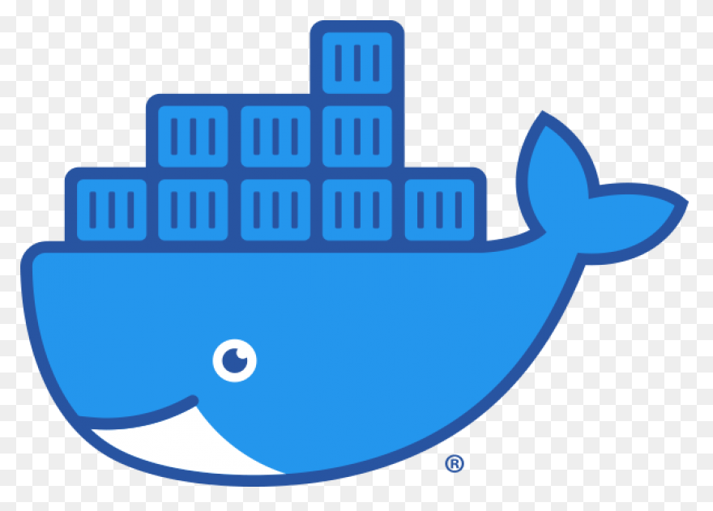</td>
    <td>Docker</td>
  </tr>
  <tr>
    <td></td>
    <td>VMware</td>
  </tr>
  <tr>
    <td>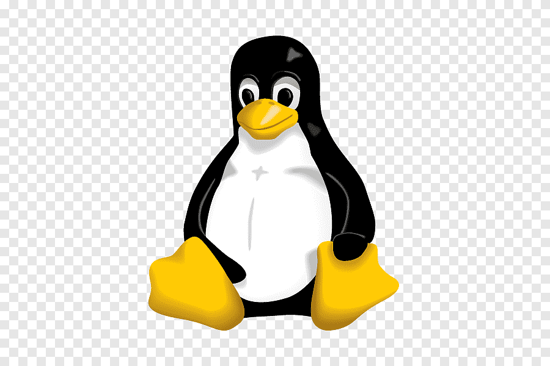</td>
    <td>Linux</td>
  </tr>
  <tr>
    <td>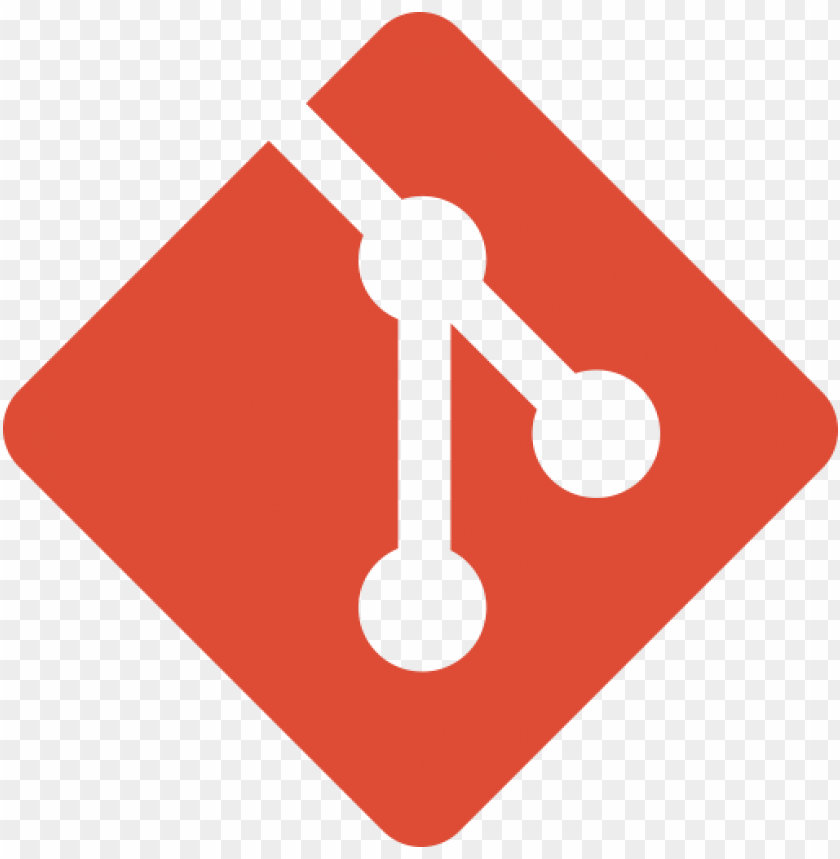</td>
    <td>Git</td>
  </tr>
  <tr>
    <td></td>
    <td>VirtualBox</td>
  </tr>
  <tr>
    <td>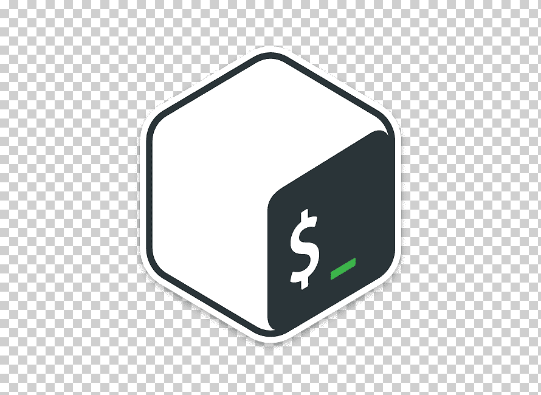</td>
    <td>Bash</td>
  </tr>

  <!-- Python -->
  <tr>
    <td rowspan="10"><strong>Python Ecosystem</strong></td>
    <td>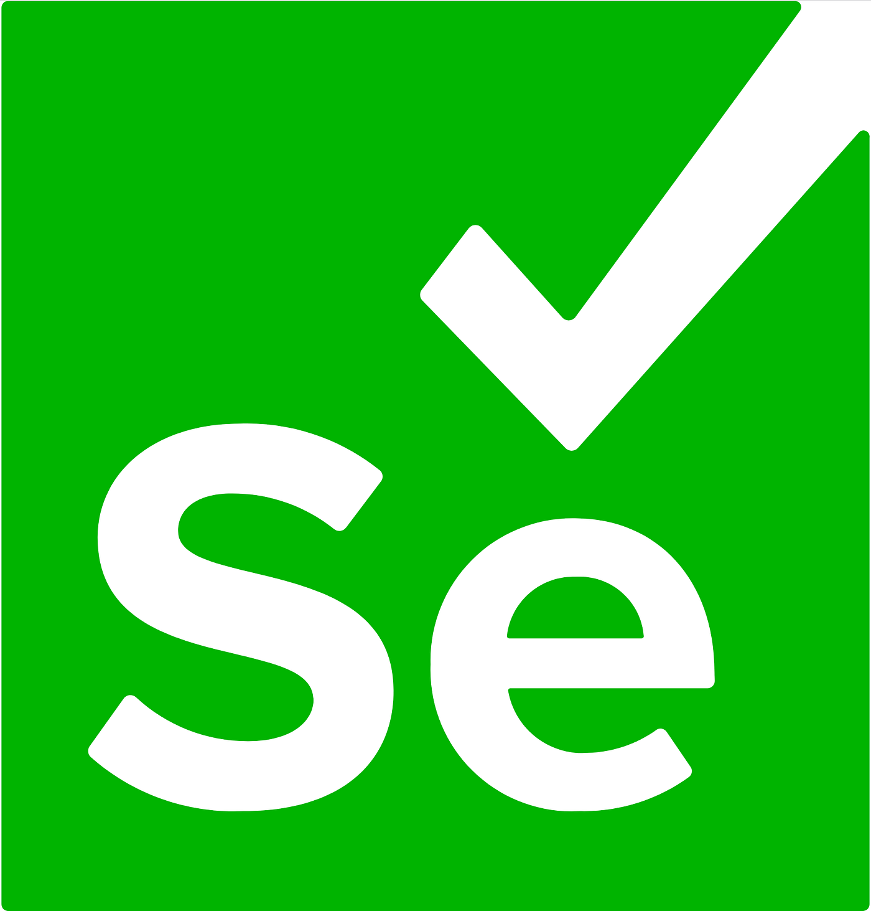</td>
    <td>Selenium</td>
  </tr>
  <tr>
    <td>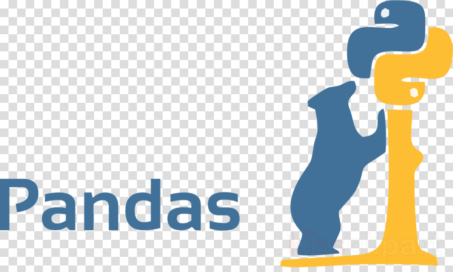</td>
    <td>Pandas</td>
  </tr>
  <tr>
    <td>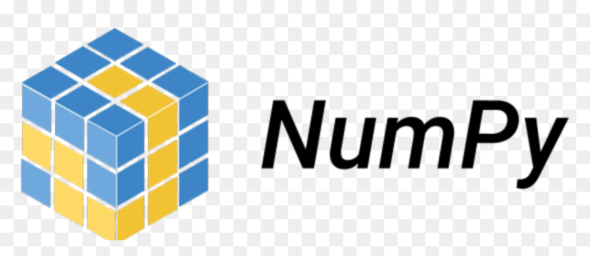</td>
    <td>NumPy</td>
  </tr>
  <tr>
    <td>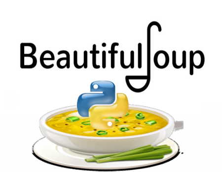</td>
    <td>BeautifulSoup</td>
  </tr>
  <tr>
    <td>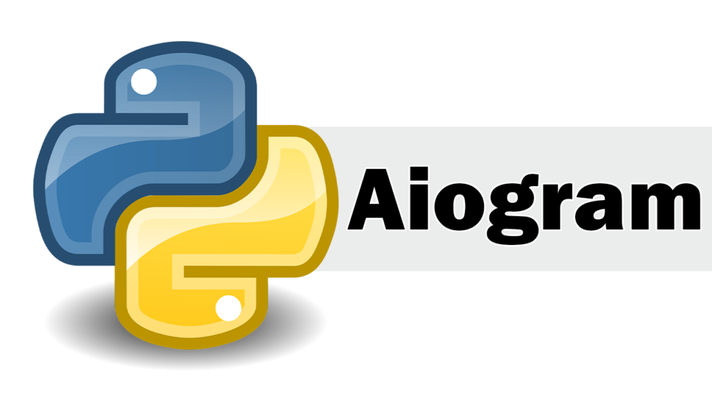</td>
    <td>Aiogram</td>
  </tr>
  <tr>
    <td>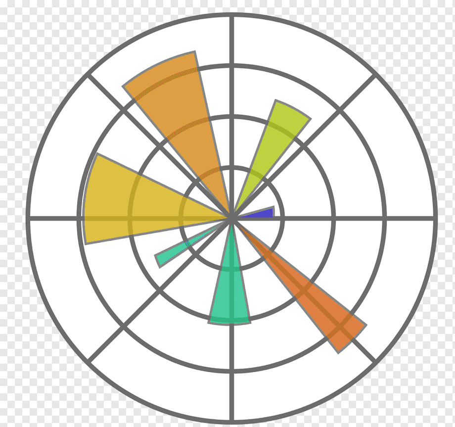</td>
    <td>Matplotlib</td>
  </tr>
  <tr>
    <td>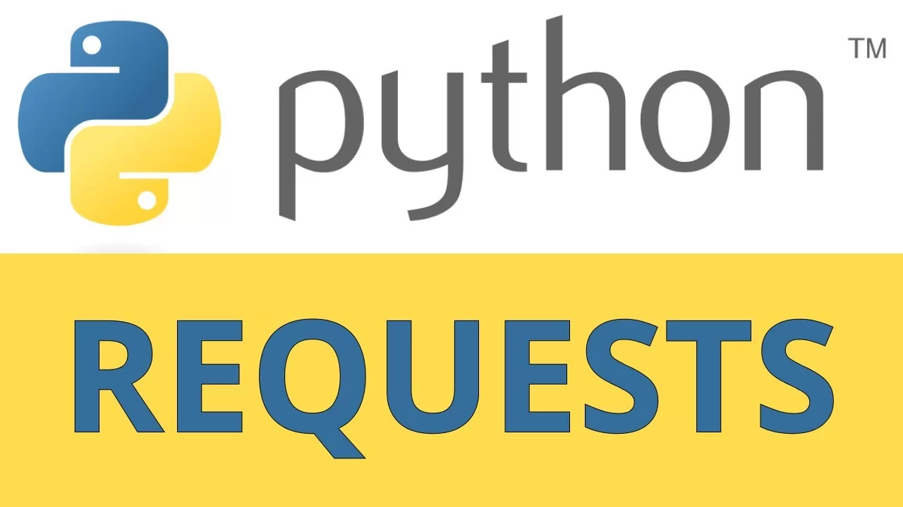</td>
    <td>Requests</td>
  </tr>
  <tr>
    <td></td>
    <td>re</td>
  </tr>
  <tr>
    <td>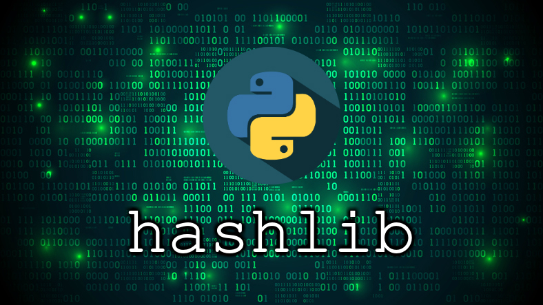</td>
    <td>hashlib</td>
  </tr>
  <tr>
    <td>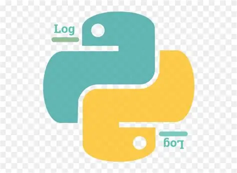</td>
    <td>logging</td>
  </tr>
</table>

---

## 🧠 Additional skills

| Skill | Description |
|-------|-------------|
| 📡 **HF Radio Signals** | Understanding of system principles, experience in analysis and processing of HF band signals |
| 🔢 **Digital Signal Processing (DSP)** | Knowledge of FFT, digital filtering, modulation/demodulation techniques |
| ⚡ **Radiophysics** | Understanding of wave propagation, electromagnetic field theory, radio wave behavior |
| ⚙️ **Automation** | Automation of various processes using Python and Bash scripts |
| 🗣️ **English** | STANAG 6001 Level 2 (B1) — reading docs, listening, speaking |

---

## 🎯 My goal

> *To grow as a specialist, improve my skills every day, and become a valuable member of a professional team. I am looking for an opportunity to work on real projects, solve practical problems, and continuously learn from experienced colleagues. My ultimate goal is to become a well-rounded expert who can handle complex tasks and bring real value to the company.*

---

## 📫 Connect with me

  
  
  
  

---

  
  *🔥 "The expert in anything was once a beginner." 🔥*

